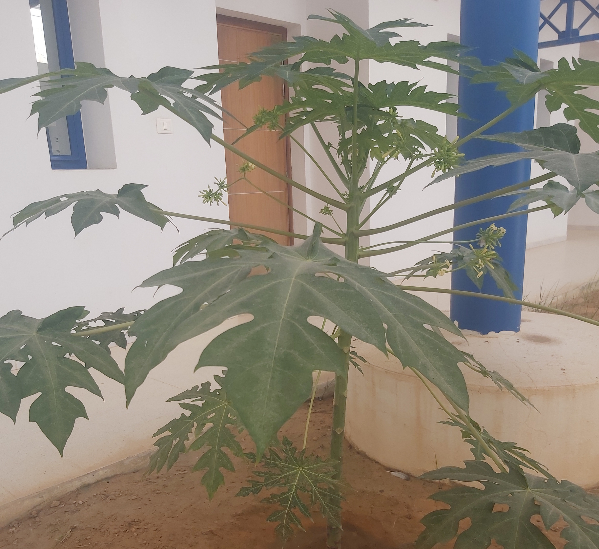
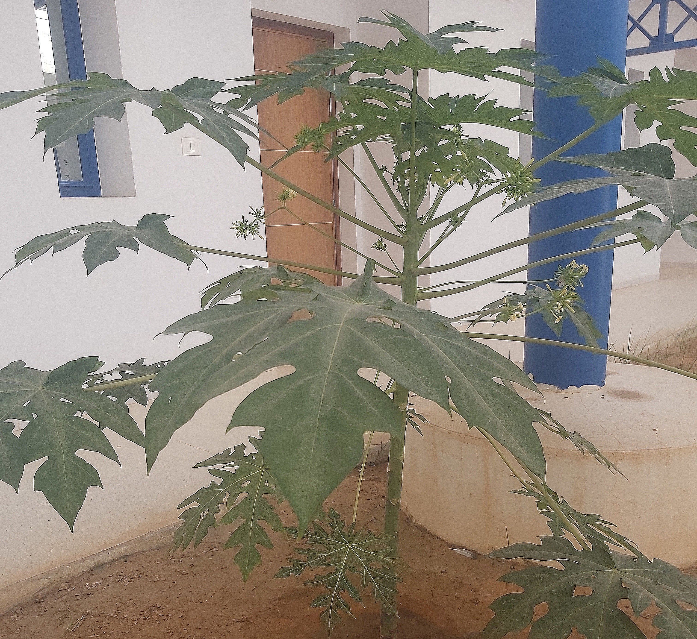
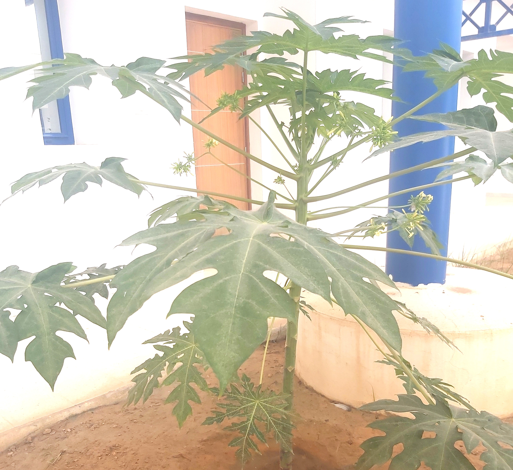
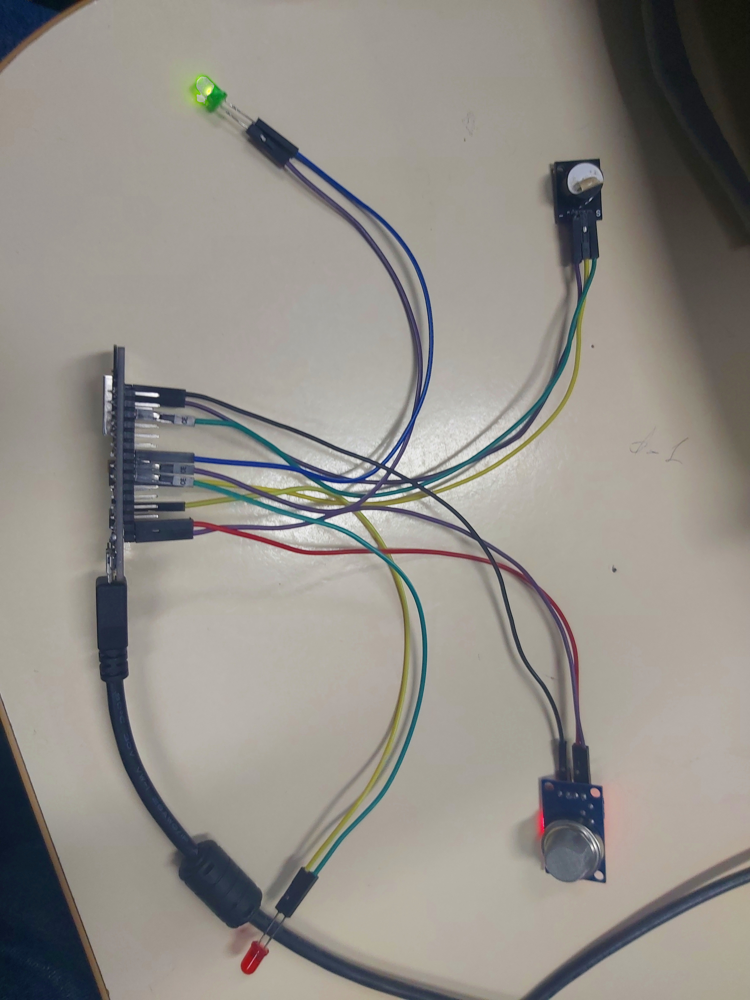
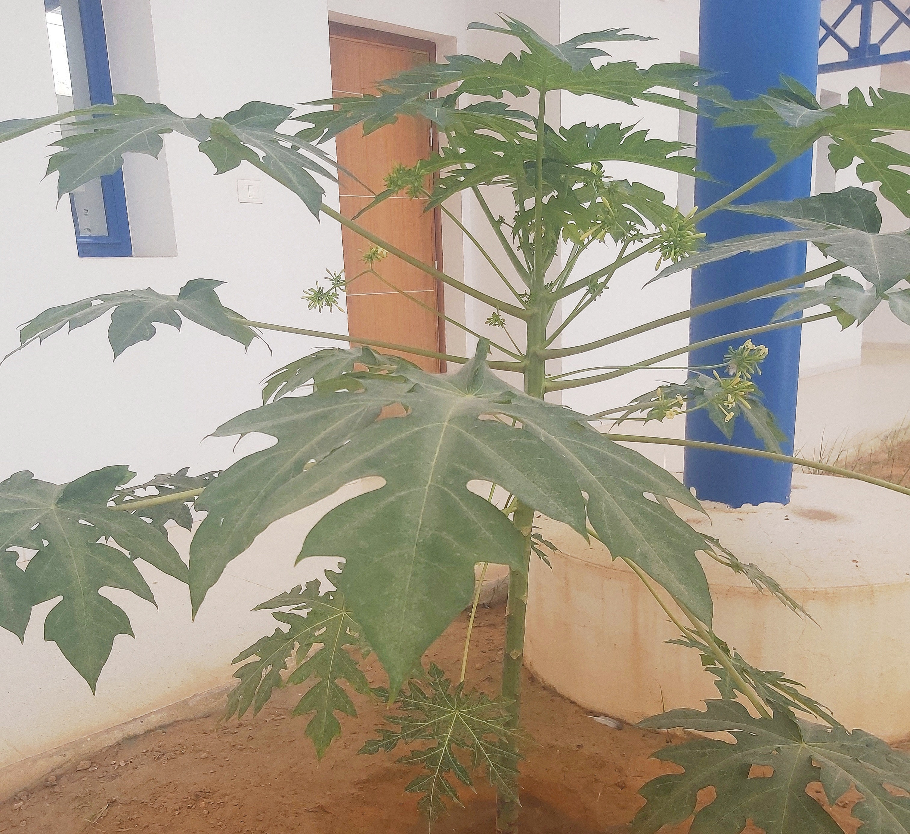

# Fog Computing — Distributed Image Processing 🌫️🖼️

Team school project (ENIS, 2023) by [Chaima Maalej](https://github.com/chaimamaalej), [Wiem Mseddi](https://github.com/mseddiwiem) and [Hadil Ben Rhouma](https://github.com/HadilBenRhouma).

One image is enhanced by several machines of a local fog network: each client PC runs a different OpenCV filter close to the data, sends its result to a central server, and the server merges the results into the final image.


## How it works

```
                   image.jpg
        ┌──────────────┼──────────────┐
        ▼              ▼              ▼
      PC2             PC3            PC4
   sharpening    brightness /     colour
                   contrast      correction
        │              │              │
  pc2_result.jpg pc3_result.jpg pc4_result.jpg
        └──────────────┼──────────────┘
                       ▼  upload
             Server (WAMP, uploads/)
                       ▼
          collect_results.py → final_result.jpg
```

| Node | Script | Processing |
|---|---|---|
| PC2 | `sharpening.py` | 3 × 3 sharpening kernel (`cv2.filter2D`) |
| PC3 | `brightness_contrast.py` | Contrast × 1.5, brightness + 10 (`cv2.convertScaleAbs`) |
| PC4 | `color_correction.py` | Saturation + 50 % in HSV space |
| Server | `collect_results.py` | Checks the results have the same size, then averages them pixel by pixel into `final_result.jpg` |

`image.jpg` is the input; `pc*_result.jpg` and `final_result.jpg` are sample outputs.

## Results

| Input | PC2 — sharpening | PC3 — brightness / contrast | PC4 — colour | Final (merged) |
|---|---|---|---|---|
|  |  |  |  |  |

## Run it

```bash
pip install "opencv-python<5" numpy
```

1. On each client PC, set `image_path` in its script, then run it (e.g. `python sharpening.py`).
2. Copy or upload the `pc*_result.jpg` files to the server folder set in `collect_results.py`.
3. On the server: `python collect_results.py` (needs at least 3 results).

`python.py` just prints the installed OpenCV version to check each machine's setup.
